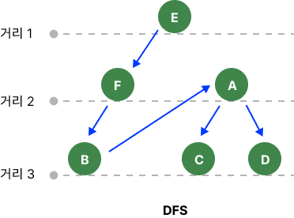

<!-- @format -->

## DFS

 
최상단에서 시작하여 해당 분기를 모두 검색하고 다음 분기로 넘어가는 방식이다.

 

최상단의 자식들을 먼저 탐색하는 방식으로 **깊이 너비 탐색**이라고 부른다.

### **사용하는 이유**

모든 노드를 방문하고 싶을 때 사용한다. 하지만 BFS에 비해 속도는 느리다.

---

## 실행구조

 

---

 

1. **E**을 스택에 먼저 담는다.
2. **E**의 자식인 **F**를 다음 스택에 담고, 이 과정을 반복한다.
3. 더 이상 자식이 없다면 **E**의 다른 자식인 **A**와 이 하위의 2번 과정을 반복한다.
