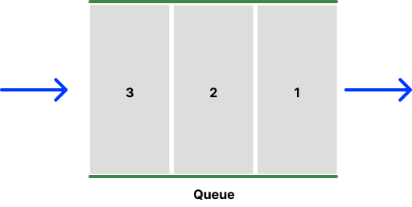

<!-- @format -->

## Queue

---

<br/>

Stack 구조 와는 달리 먼저 들어간 원소가 먼저 나오게 되는 방식이다.

**FIFO** : Fist In First Out

구멍이 두 개라고 생각하자.



---

```js
const queue = [];
let head = 0;

// 가장 마지막에 원소를 추가
queue.push(value);

// 가장 마지막에 접근 후 삭제
queue.pop();

// 가장 앞에 원소를 접근 후 삭제
queue[head++];

// 가장 마지막의 원소에 접근
queue[queue.length - 1];

// 가장 앞에 원소에 접근
queue[head];

// queue의 길이를 판별
queue.length - head;

// queue가 비어있는지 판별
queue.length - head === 0;
```
