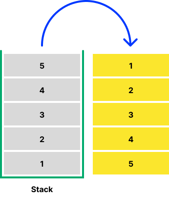

<!-- @format -->

## Stack

---

<br/>
Stack은 바로 한쪽 끝에서만 원소를 넣거나 뺄 수 있는 자료구조
출입구가 하나라고 생각하자.



Stack은 구조(LIFO)의 특성상 **나중에 넣은 원소가 먼저 나오게 되어 있습니다**.

**LIFO**: Last-In-First-Out

---

### 특징

- 최상단에 원소를 **추가**
- 최상단에 원소를 **삭제**
- 최상단에 원소를 **접근**

---

```js
const stack = [a, b, c];

//최상단 원소 추가
stack.push(d);
console.log(stack); //[a, b, c, d]

//최상단 원소 접근 / 삭제
const accessRemove = stack.pop();
console.log(accessRemove, stack);
//d, [a, b, c]

const access = stack[stack.length - 1];
console.log(access, stack);
//d, [a, b, c]

//stack의 길이 판별
const size = stack.length;
console.log(size); // 3
```
