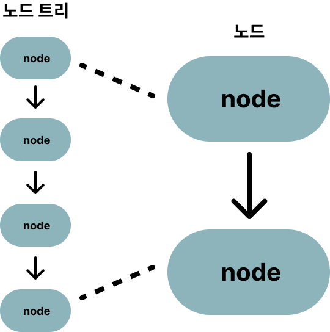

<!-- @format -->

## **노드**

- **노드** : 계층적 단위
- **노드트리** : 노드들의 집합, 노드간의 관계를 보여줌.

---

**HTML DOM**은 노드라고 불리는 **계층적 단위**에 정보를 저장합니다.
HTML DOM은 노드들을 정의하고, 그 사이의 관계를 설명해주는 역할을 합니다.
HTML 문서의 정보는 **노드트리하고 불리는 계층적 구조**에 저장된다.
최상위 레벨엔 루트 노드부터 최하위인 텍스트 노드까지 존재한다.
HTML DOM을 이용하여 노드 트리에 포함된 모든 노드에 접근할 수 있다.

---

### **노드 종류**

**문서** - 문서 전체 
**요소** - 속성 노드를 유일하게 가질 수 있다. 
**속성** - html 요소의 속성, 요소 노드에 관한 정보를 가지고 있다. 하지만 요소 노드의 자식 노드에는 포함되지 않는다. 
**텍스트** - 문서의 모든 텍스트 
**주석** - 문서의 모든 주석

**현재 노드**

- 같은 부모 노드를 가진 모든 노드를 가리킨다.

**조상 노드**

- 부모 노드를 포함해 계층적으로 현재 노드보다 상위에 존재하는 모든 노드를 가리킨다.

**자손 노드**

- 자식 노드를 포함해 계층적으로 현재 노드 보다 하위에 존재하는 모든 노드를 가리킨다.

---

### **노드 간의 관계**

1. parentNode : 부모 노드
2. childNodes : 자식 노드 리스트
3. firstChild : 첫 번째 자식 노드
4. lastChild : 마지막 자식 노드
5. nextSibling : 다음 형제 노드
6. previousSibling : 이전 형제 노드

빈 텍스트는 텍스트 노드로 처리된다.

---

### **노드 추가하기**

appendChild() : 새로운 노드를 해당 노드 리스트 맨 마지막에 추가

insertBefore() : 새로운 노드를 특정 자식 노드 바로 앞에 추가

insertData() : 텍스트 노드를 텍스트 데이터에 새로운 텍스트로 추가s

---

### **노드 생성하기**

createElement() : 새로운 요소 노드 생성

createAttribute() : 새로운 속성 노드 생성, 덮어쓰기

createTextNode() : 새로운 텍스트 노드 생성

---

### **노드 제거하기**

removeChild() : 자식 노드 리스트에서 특정 자식 노드를 제거, 제거된 노드 반환
제거되는 자식들 모두 제거

removeAttribute() : 속성의 이름을 활용하여 특정 속성 노드 제거

---

### **노드 복제하기**

cloneNode() : 기존의 존재하는 노드와 동일한 노드를 생성, 반환

복제할 노드의 자식 노드들 복제 여부는

복제할 노드.cloneNode(true)이다. 전달 값이 true면 자식과 모든 속성 같이 복제

false면 노드만 복제 자식은 복제하지 않는다

---

### **노드 교체**

replaceChild() : 기존의 요소 노드를 새로운 노드로 교체

replaceData() : 텍스트 노드의 텍스트 데이터 교체
