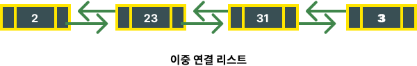
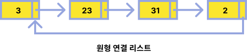

<!-- @format -->

## 연결 리스트

 

### 연결리스트란?

원소들을 저장할 때 그 다음 원소가 있는 **위치를 포함**시키는 방식으로 저장하는 자료구조

### 연결 리스트 종류

#### 단일 연결 리스트

각 원소가 자신의 다음 원소의 주소를 갖고 있는 연결 리스트

#### 이중 연결 리스트

각 원소가 자신의 이전 원소와 다음 원소의 주소를 갖고 있는 연결 리스트

#### 원형 연결 리스트

끝이 처음과 연결되어 있는 연결 리스트
각 원소가 이전 / 다음 원소의 주소를 갖고 있어도 상관 없다.

##  

## 배열과의 차이점

- 배열은 데이터의 삽입 / 삭제에는 취약하다. 하지만 연결리스트에서 데이터의 삽입과 삭제는 논리적 주소만 바꿔주면 되기 때문에 훨씬 쉽다는 장점이 있다.

- 데이터 양이 많지만 데이터의 삽입 / 삭제가 거의 일어나지 않고, 데이터 접근이 많이 이루어질 경우에는 배열이 유리하다.
