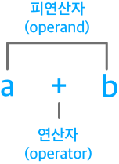
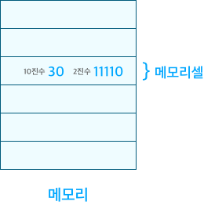
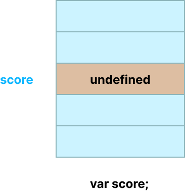
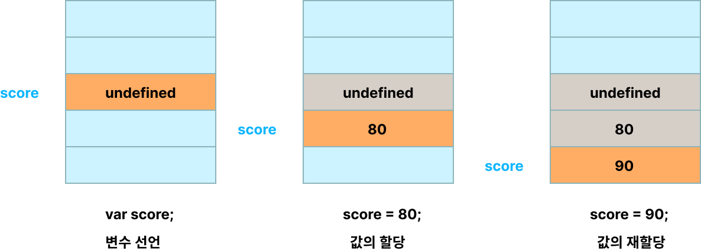

<!-- @format -->

## **변수**

variable

자바스크립트 엔진이 코드를 계산하려면 코드 안에서 사용되는 기호(리터럴, 연산자)의 의미를 알고 있어야 하며, 식(표현식)의 의미도 해석할 수 있어야 한다.

##### **리터럴** : 소스 코드의 고정된 값을 대표하는 용어

##### **연산자** : 주어진 식을 계산하여 결과를 얻어내는 과정을 연산이라고 하며, 연산을 수행하는 기호를 연산자

##### **피연산자** : 연산을 수행하려면 반드시 연산의 대상이 있어야 하는데, 이를 피연산자(operand) 라고 한다.

<br/>



<br/>

사람은 계산과 기억을 모두 두뇌에서 하지만, 컴퓨터는 연산과 기억을 수행하는 부품이 나눠져 있다.
CPU에서 연산을, 메모리에서 기억을 수행한다.

#### **메모리**

데이터를 저장할 수 있는 **메모리 셀**의 집합체
메모리 셀 하나의 크기는 1바이트(8비트)

컴퓨터는 메모리 셀의 크기, 1바이트 단위로 데이터를 저장(write)하거나 읽어(read)들인다.

각 셀은 고유의 메모리 주소를 갖는다.
메모리 주소는 메모리 공간의 위치를 나타내며, 0부터 시작하여 메모리의 크기만큼 정수로 표현된다.

컴퓨터는 모든 데이터를 2진수로 처리한다.
메모리에 저장되는 모든 데이터의 종류는 2진수로 저장된다.

<br/>



```
10 + 20
```

이제는 위와 같은 계산식을 컴퓨터가 어떤 방식으로 해결하는 지 알았다.

하지만 10과 20을 더해서 만들어낸 숫자 30을 저장하였지만 재사용할 수 없다는 문제가 있다.

10과 20을 더해서 연산 결과를 단 한번만 사용한다면 문제가 없겠지만 만약 연산 결과를 재사용하고 싶다면 메모리 주소를 통해 저장된 메모리 공간에 직접 접근하는 것 외에는 방법이 없다.

하지만 직접 메모리에 접근하는 것은 치명적인 오류를 발생시킬 가능성이 높다. 따라서 **자바스크립트는 개발자의 직접적인 메모리 제어를 허용하지 않는다.**

따라서 프로그래밍 언어는 기억하고 싶은 값을 메모리에 저장하고, 저장된 값을 읽어 들여 재사용하기 위해 변수라는 메커니즘을 제공한다.

<br/>

### **변수**

하나의 값을 저장하기 위해 확보된 메모리 공간 자체 또는 그 메모리 공간을 식별하기 위해 붙인 이름

변수는 프로그래밍 언어의 컴파일러 혹은 인터프리터에 의해 값이 저장된 메모리 공간의 주소로 치환되어 실행된다.

=> 변수를 통해 안전하게 값에 접근할 수 있다.

#### **변수에 여러 개의 값을 저장하는 방법**

배열이나 객체같은 자료구조를 사용하면 여러 개의 값을 그룹화하여 하나의 값처럼 사용할 수 있다.

```js
// 하나의 값
const user = 'suin';

// 여러개의 값
const users = ['suin', 'jay'];
```

---

변수를 사용해 다시 한 번 작성해보자.

```js
var result = 10 + 20;
```


변수에 값을 저장하는 것을 **할당**이라하고, 변수에 저장된 값을 읽어 들이는 것을 **참조**라고 한다.

##### **동작 원리**

1. 변수 이름을 사용해 참조 요청
2. 자바스크립트 엔진이 변수 이름과 매핑된 메모리 주소를 검색
3. 메모리 공간에 접근하여 저장된 값을 반환

<br/>

---

## **식별자**

identifier
어떤 값을 구별해서 식별할 수 있는 고유한 이름을 말한다.

값은 메모리 공간에 저장되어 있다.
따라서 식별자는 메모리 공간에 저장되어 있는 어떤 값을 구별해서 식별해낼 수 있어야 한다.
=> 어떤 값이 저장되어 있는 메모리 주소를 기억(저장)해야 한다.


위에 자료에서 식별자 result(30)의 메모리 주소는 0x0669F913이다.
식별자는 값이 저장되어 있는 메모리 주소와 매핑 관계를 맺으며, 이 매핑 정보도 메모리에 저장되어야 한다.

식별자는 값이 아닌 메모리 주소를 기억하고 있다.
즉, 식별자는 메모리 주소에 붙인 이름이라고 볼 수 있다. => 메모리 주소를 통해 메모리 공간에 저장된 값에 접근 가능한 것

식별자라는 용어는 변수 뿐만 아니라 함수, 클래스 등의 모든 이름은 식별자이다.

식별자는 네이밍 규칙을 준수해야 하며, 선언에 의해 자바스크립트 엔진에 식별자의 존재를 알린다.

<br/>

---

## **변수 선언**

변수 선언이란 **변수를 생성**하는 것을 말한다.

**값을 저장하기 위해 메모리 공간을 확보, 변수 이름과 확보된 메모리 공간의 주소를 연결할 수 있게 준비하는 것**

변수 선언에 의해 확보된 메모리 공간은 확보가 해제되기전까지는 누구도 확보된 메모리 공간을 사용할 수 없도록 보호된다.

변수를 사용하려면 선언이 반드시 필요하다.
var, let, const 키워드를 사용하여 선언한다.

##### **키워드** : 자바스크립트 코드를 해석하고 실행하는 자바스크립트 엔진이 수행할 동작을 규정한 일종의 명령어. 엔진은 키워드를 만나면 자신이 수행해야할 약속된 동작을 수행한다.

### **var**

```js
var score;
```

위의 선언문은 변수 이름을 등록하고 값을 저장할 메모리 공간을 확보한다.



현재 변수를 선언하고, 변수에 값을 할당하지 않았다.
따라서 변수 선언에 의해 확보된 메모리 공간은 비어있다고 생각할 수 있으나 확보된 메모리 공간은 자바스크립트 엔진에 의해 undefined라는 값이 암묵적으로 할당되어 초기화된다.

#### **자바스크립트 엔진의 변수 선언 단계**

##### **선언 단계** : 변수 이름을 등록해 자바스크립트 엔진에 변수의 존재를 알림.

##### **초기화 단계** : 값을 저장하기 위한 메모리 공간을 확보하고 암묵적으로 undefined를 할당해 초기화한다.

<br/>

---

#### **초기화란?**

변수가 선언된 이후 최초로 값을 할당하는 것을 말한다. var 키워드로 선언한 변수는 undefined로 암묵적인 초기화가 자동 수행된다.

**var 키워드** 를 사용한 변수 선언은 선언단계와 초기화 단계가 동시에 실행된다.

초기화 단계를 거치지 않으면 확보된 메모리 공간에는 이전에 사용했던 값이 남아 있을 수 있다.
이러한 값을 쓰레기 값이라 한다.

자바스크립트의 var 키워드는 암묵적으로 초기화를 수행하므로 이러한 위협으로부터 안전하다.

만약 선언하지 않은 식별자에 접근하면 **ReferenceError(참조 에러)** 가 발생한다.

ReferenceError는 식별자를 통해 값을 참조하려 했지만 자바스크립트 엔진이 등록된 식별자를 찾을 수 없을 때 발생하는 에러다.

<br/>

---

## **변수 선언의 실행 시점과 변수 호이스팅**

```js
console.log(score); // undefined

var score; // 변수 선언문
```

변수 선언문 보다 변수를 참조하는 코드가 앞에 있다.

자바스크립트 코드는 인터프리터에 의해 한 줄씩 순차적으로 실행되므로 **console.log(score);** 가 가장 먼저 실행되고, 순차적으로 다음 줄에 있는 코드를 실행한다.

따라서, console.log(score);가 실행되는 시점에는 아직 score가 선언되지 않았으므로 참조에러가 발생할 것으로 보인다.

하지만 참조에러가 발생하지 않고 undefined가 출력된다.

**그 이유는 변수 선언이 소스코드가 한 줄씩 순차적으로 실행되는 시점, 즉 런타임이 아니라 그 이전 단계에서 먼저 실행되기 때문이다.**

자바스크립트 엔진은 코드를 실행하기 전 실행을 위한 준비 단계인 소스코드의 평가 과정에서 변수 선언을 포함한 모든 선언문을 소스코드에서 찾아내 먼저 실행한다.

그리고 소스코드의 평가과정이 끝나면, 변수 선언을 포함한 모든 선언문을 제외하고 소스코드를 한 줄씩 순차적으로 실행된다.

즉, 자바스크립트 엔진은 변수 선언이 소스코드의 어디에 있든 상관없이 다른 코드보다 먼저 실행한다.

undefined가 출력되는 것은 변수선언(선언 단계와 초기화 단계)이 소스코드가 순차적으로 실행되는 런타임 이전 단계에서 먼저 실행된다는 증거다.

이처럼 변수 선언문이 코드의 선두로 끌어 올려진 것처럼 동작하는 자바스크립트 고유의 특징을 **변수 호이스팅**이라고 한다.

##### 변수 선언뿐만 아니라 키워드를 사용해서 선언하는 모든 식별자는 호이스팅된다. 모든 선언문은 런타임 이전 단계에서 먼저 실행되기 때문이다.

<br/>

---

## **값의 할당**

변수에 값을 할당할때는 **할당 연산자 =**를 사용한다.

```js
var score;
score = 20;
```

변수 선언과 값의 할당을 하나의 문으로 단축 표현할 수 있다.

```js
var score = 20;
```

2개의 문을 하나의 문으로 단축시켜도 코드는 동일하게 동작한다.
=> 하나의 문으로 단축 표현해도 변수 선언과 값의 할당을 2개의 문으로 나누어 각각 실행한다.

#### **주의할점**

변수선언과 값의 할당의 실행 시점이 다르다는 것이다.

변수 선언은 소스코드가 순차적으로 실행되는 시점인 런타임 이전에 먼저 실행된다.
값의 할당은 소스코드가 순차적으로 실행되는 시점인 런타임에 실행된다.

**2개의 문**

```js
console.log(score); // undefined

var score; // 1 변수 선언
score = 80; // 2 값의 할당

console.log(score); // 80
```

**단축문**

```js
console.log(score);

var score = 80;

console.log(score);
```

**2개의 문**과 **단축문** 이 동작하는 과정이 동일하다.

<br/>

---

## **값의 재할당**

재할당이란 이미 값이 할당되어 있는 변수에 새로운 값을 또다시 할당하는 것을 말한다.

var 키워드로 선언한 변수는 재할당할 수 있다.

**재할당**은 현재 변수에 저장된 값을 버리고 새로운 값을 저장하는 것이다. var 키워드로 선언한 변수는 선언과 동시에 undefined로 초기화되기 때문에 엄밀히 말하면 변수에 처음으로 값을 할당하는 것도 재할당이다.

만약 값을 재할당할 수 없어서 변수에 저장된 값을 변경할 수 없다면 변수가 아니라 **상수**이다.

```js
var score = 80; // 변수 선언과 값의 할당
score = 90; // 값의 재할당
```



**값의 재할당 동작단계**
이전의 값을 지우고 그 메모리 공간에 재할당 값을 새롭게 저장하는 것이 아니라 새로운 메모리 공간을 확보하고 그 메모리 공간에 숫자 값을 저장한다.

이제는 사용하지 않는 변수 값이 undefined와 80은 어떤 변수도 값으로 갖고 있지 않다. = 어떤 식별자와도 연결되어 있지 않다.

이러한 불필요한 값들은 **가비지 콜렉터**에 의해 메모리에서 자동 해제된다. 단 메모리에서 언제 해제될지는 예측할 수 없다.

###### **가비지 콜렉터** : 애플리케이션이 할당한 메모리 공간을 주기적으로 검사하여 더 이상 사용되지 않는 메모리를 해제하는 기능을 말한다. 자바스크립트는 가비지 콜렉터를 내장하고 있는 **매니지드 언어**로서 가비지 콜렉터를 통해 메모리 누수를 방지한다.

##### **언매니지드 언어와 매니지드 언어**

언매니지드 언어는 개발자가 명시적으로 메모리를 할당하고 해제하기 위해 저수준 메모리 제어 기능을 제공한다.
매니지드 언어는 개발자가 명시적으로 메모리를 할당하고 해제할 수 없다. 더 이상 사용하지 않는 메모리 해제는 가비지 콜렉터가 수행한다.

<br/>

---

## **const 키워드**

ES6에서 도입된 const 키워드를 사용해 선언한 변수는 재할당이 금지된다. 따라서 단 한번만 할당할 수 있는 변수를 선언한다.
즉, const 키워드를 사용하면 상수를 표현할 수 있다.

<br/>

---

## **식별자 네이밍 규칙**

식별자는 다음과 같은 네이밍 규칙을 준수해야 한다.

- 특수문자를 제외한 문자, 숫자, 언더스코어(\_), 달러 기호($)를 포함할 수 있다.
- 특수문자를 제외한 문자, 언더스코어(\_), 달러 기호($)로 시작해야한다. 숫자로 시작하는 것은 허용되지 않는다.
- 예약어는 식별자로 사용할 수 없다.

---

- 변수는 쉼표(,)로 구분해 하나의 문에서 여러 개를 한번에 선언할 수 있다. 하지만 가독성이 나빠져 권장하지 않는다.

```js
var peson, $elem;
```

- ES5부터 식별자를 만들 때 유니코드 문자를 허용함, 하지만 바람직하지 않아 권장하지 않는다.

```js
var 이름;
```

- 자바스크립트는 대소문자를 구별한다. 따라서 다음 변수는 별개이다.

```js
var firstname;
var firstName;
var FirstName;
```

- 변수 이름은 변수의 존재 목적을 쉽게 이해할 수 있도록 표현해야함.

```js
var x = 3; // x변수가 의미하는 바를 알 수 없다
var score = 100; // score 변수는 점수를 의미함
```

변수 선언에 주석이 필요하다면 명확히 존재 목적을 드러내지 못하는 것이다.

### **네이밍 컨벤션**

하나 이상의 영어 단어로 구성된 식별자를 만들 때 가독성 좋게 단어를 한눈에 구분하기 위해 규정한 명명 규칙이다.

#### **4가지 유형의 네이밍 컨벤션**

- 카멜 케이스
  `var firstName`
- 스네이크 케이스
  `var first_name`
- 파스칼 케이스
  `var FirstName`
- 헝가리언 케이스
  `var strFirstName`
