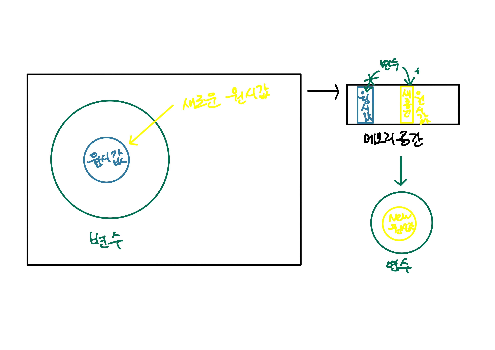
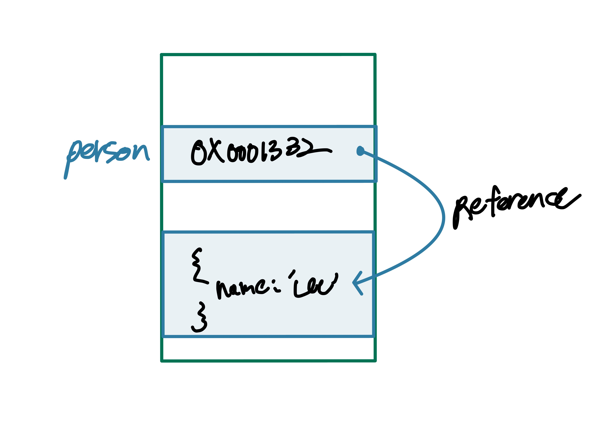
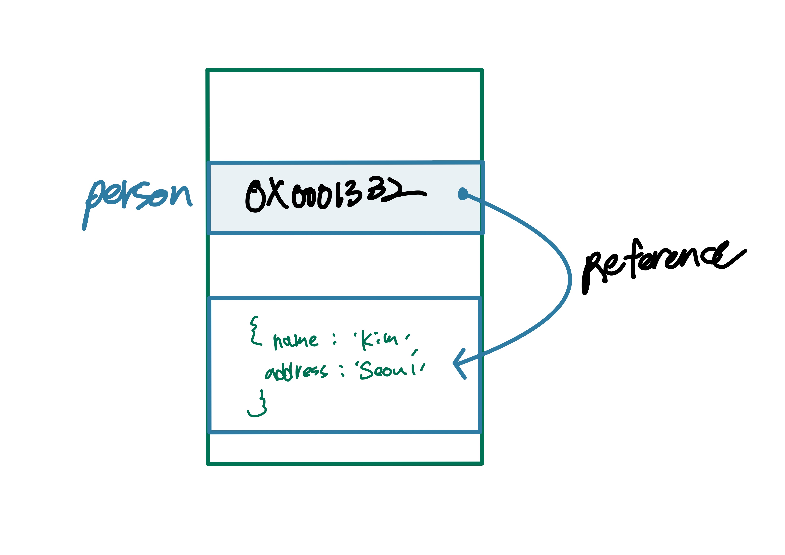
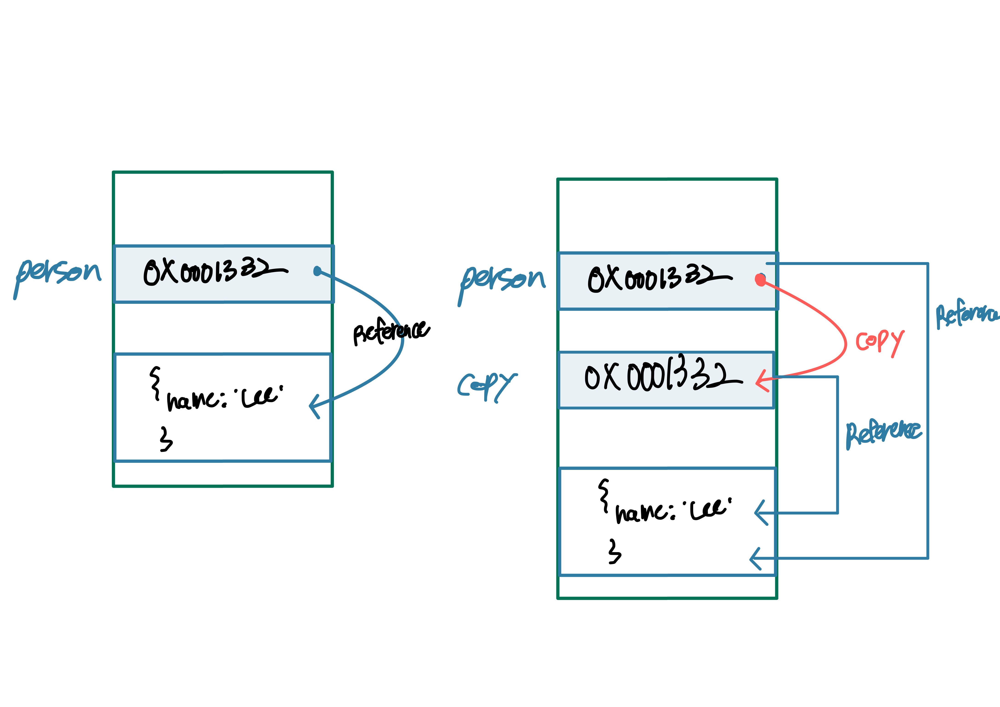

<!-- @format -->

# **원시 값과 객체의 비교**

<br/>

자바스크립트가 제공하는 7가지의 데이터 타입은 원시 타입과 객체 타입으로 구분되어 있었다.

데이터 타입을 이렇게 구분하는 이유는 **근본적으로 다르기 때문** 이다.

- 원시 타입의 값은 변경이 불가능한 값이다. 객체 타입의 값은 변경이 가능하다.

- 원시 값을 변수에 할당하면 변수에는 실제 값이 저장된다. 객체를 변수에 할당하면 변수에는 참조 값이 저장된다.

- 원시 값을 갖는 변수를 다른 변수에 할당하면 원본의 원시 값이 복사되어 전달된다. 이를 **값에 의한 전달**이라 한다. 객체를 가리키는 변수를 다른 변수에 할당하면 원본의 참조 값이 복사되어 전달된다. 이를 **참조에 의한 전달**이라고 한다.

**정리하자면**

원시 타입은 값의 변경이 불가능하고, 원시 값을 변수에 할당하면 실제 값이 저장된다. 또한 값에 의한 전달이 이루어진다.

객체 타입은 값의 변경이 가능하며, 객체 값을 변수에 할당하면 참조 값이 저장된다. 또한 참조에 의한 전달이 이루어진다.

<br/>

---

## **원시 값**

### **변경 불가능한 값**

원시 값은 변경 불가능한 값으로, 한 번 생성된 원시 값은 읽기 전용 값으로서 변경할 수 없다.

변수는 하나의 값을 저장하기 위해 확보한 메모리 공간을 위해 붙인 이름이고, 값은 변수에 저장된 값된 데이터다.

따라서 **변경 불가능하다는 것**은 변수가 아니라 **값에 대한 진술**이다.

그렇다면 변경이 불가능하다는 점에서 상수와 원시 값을 동일시할 수 있지만 상수는 단지 재할당이 금지된 변수일 뿐이다는 점을 잊지말자

원시 값은 어떤 일이 있어도 불변한다. 이러한 원시 값의 특성은 **데이터의 신뢰성을 보장**한다.

원시 값을 할당한 변수에 새로운 원시 값을 재할당하면 메모리 공간에 저장되어 있는 원시 값을 변경하는 것이 아니라 새로운 메모리 공간을 확보하고 원시 값을 저장한 후, 새로운 원시 값을 가리킨다. 이때 변수가 참조하던 메모리 공간의 주소가 바뀐다.

<br/>



이러한 특성을 **불변성**이라고 한다.

불변성을 갖는 원시 값을 할당한 변수는 재할당 이외에 변수 값을 변경할 수 있는 방법이 없다.

<br/>

### **문자열과 불변성**

원시 값을 저장하려면 먼저 확보해야 하는 메모리 공간의 크기를 결정해야 한다.

원시 값인 문자열은 다른 원시 값과 비교할 때 독특한 특징이 있다.

문자열은 0개 이상의 문자로 이뤄진 집합을 말하며, 1개의 문자는 2바이트의 메모리 공간에 저장된다. 따라서 문자열은 몇 개의 문자로 이루어져 있느냐에 따라 필요한 메모리 공간의 크기가 결정된다.

숫자 값은 1도, 100000도 동일한 8바이트가 필요하지만 문자열은 문자 수의 비례하여 바이트가 필요하다.

문자열의 한 문자를 변경하면 'string'의 s만 대문자로 변경해보자.

```js
var str = 'string';

str[0] = S;

console.log(str); // 'string'
```

에러가 나지 않고 변경도 되지 않았다. 이처럼 데이터의 신뢰성을 보장할 수 있다.

하지만 새로운 문자열을 재할당하는 것은 가능하다.

<br/>

---

### **값에 의한 전달**

```js
var score = 80;
var copy = score;

score = 100;

console.log(score); // 100
console.log(copy); // 80
```

copy변수에 원시 값을 갖는 score변수를 할당하면 할당받는 변수에는 할당되는 변수의 원시 값 80이 복사되어 전달된다.

```js
var score = 80;

var copy = score;

console.log(score === copy); // true
```

copy변수와 score변수는 숫자 값 80을 갖고 있었다.
하지만 변수가 가진 값 80은 다른 메모리 공간에 저장된 별개의 값이다.

<br/>


따라서 score변수의 값을 변경해도 copy 변수의 값에는 어떠한 영향도 주지 않는다.

엄격하게 표현하면 변수에는 값이 전달되는 것이 아니라 메모리 주소가 전달된다.

이는 변수와 같은 식별자는 값이 아니라 메모리 주소를 기억하고 있기 때문이다.

**값에 의한 전달** 도 사실은 값을 전달하는 것이 아니라 메모리 주소를 전달한다. 단, 전달된 메모리 주소를 통해 메모리 공간에 접근하면 값을 참조할 수 있다.

**중요한 것은 결국 두 변수의 원시 값은 서로 다른 메모리 공간에 저장된 별개의 값이 되어 어느 한쪽에서 재할당을 통해 값을 변경하더라도 서로 간섭할 수 없다는 것이다.**

<br/>

---

## **객체**

객체의 프로퍼티의 개수는 정해져 있지 않고 동적으로 추가되며 삭제할 수 있다.

객체는 원시 값과는 다른 방식으로 동작하도록 설계되어 있다.

### **객체의 관리 방식**

객체는 프로퍼티 키를 인덱스로 사용하는 해시 테이블이라고 생각할 수 있다.

다른 언어는 사전에 정의된 클래스를 기반으록 객체를 생성한다. 객체가 생성되기 전에 이미 프로퍼티와 메서드가 정해져 있고 그대로 객체를 생성한다는 말이다.
객체가 생성된 이후에는 프로퍼티를 삭제하거나 추가할 수 없다.

자바스크립트는 클래스 없이 객체를 생성하고 생성된 이후라도 동적으로 프로퍼티와 메서드를 추가할 수 있다.
이는 매우 편리하지만 이론적으로는 다른 언어 보다 접근과 생성에 더 많은 비용이 드는 비효율적인 방식이다.

따라서 V8에서는 프로퍼티에 접근하기 위해 동적 탐색 대신 히든 클래스라는 방식을 사용해 접근하는 정도의 성능을 보장한다.

히든 클래스는 자바와 같이 고정된 객체 레이아웃과 유사하게 동작한다.

### **변경 가능한 값**

객체는 변경가능한 값이다.

```js
var person = {
	name: 'Lee',
};
```

원시 값을 할당한 변수가 기억하는 메모리 주소를 통해 메모리 공간에 접근하면 원시 값에 접근할 수 있다.

**원시 값을 할당한 변수는 원시 값 자체를 값으로 가짐**

하지만 객체를 할당한 변수가 기억하는 메모리 주소를 통해 메모리 공간에 접근하면 **참조 값**에 접근할 수 있다.

**참조 값은 생성된 객체가 저장된 메모리 공간의 주소 그 자체다.**

<br/>



객체를 할당한 변수에는 생성된 객체가 실제로 저장된 공간의 주소가 저장되어 있다. 이 값을 **참조값**이라고 한다.

원시 값을 할당한 변수를 참조하면 메모리에 저장된 원시 값에 접근한다. 하지만 객체를 할당한 변수를 참조하면 메모리에 저장되어 있는 참조 값을 통해 실제 객체에 접근한다.

객체는 변경 가능한 값으로 메모리에 저장된 객체를 직접 수정할 있다. 객체를 할당한 변수에 재할당하지 않았으므로 객체를 할당한 변수의 참조 값은 변경되지 않는다.

```js
var person = {
	name: 'Lee',
};

// 값 갱신
person.name = 'Kim';

// 프로퍼티 동적 생성
person.address = 'Seoul';

console.log(person); // {name: 'Kim, address: 'Seoul''}
```

<br/>



객체를 생성하고 관리하는 일은 비용이 많이 들고 복잡하다. 때문에 객체를 복사해 생성하는 비용을 줄이고 성능을 향상시키기 위해 객체는 변경 가능하게 설계되어 있다.

하지만 **여러 개의 식별자가 하나의 객체를 공유할 수 있다는 단점**이 존재한다.

<br/>

### **참조에 의한 전달**

**여러 개의 식별자가 하나의 객체를 공유할 수 있다**는 것이 무엇인지 알아보자.

```js
var person = {
	name: 'Lee',
};

// 얇은 복사
var copy = person;
```

객체를 가리키는 변수를 다른 변수에 할당하면 원본의 참조 값이 복사되어 전달된다. => **참조에 의한 전달**

<br/>



저장된 메모리 주소는 다르지만 동일한 참조 값을 갖는다. 다시 말해 동일한 객체를 가리킨다.

이것은 **두 개의 식별자가 하나의 객체를 공유**한다는 것을 의미한다.

**원본 또는 사본 중 어느 한쪽에서 객체 값을 변경한다면 서로 영향을 주고 받는다.**

```js
var person = {
	name: 'Lee',
};

// 얇은 복사
var copy = person;

console.log(copy === person); // true

copy.name = 'Kim';

person.address = 'Seoul';

console.log(person); // {name: 'Kim', address: 'Seoul'}
console.log(copy); // {name: 'Kim', address: 'Seoul'}
```

**값에 의한 전달**과 **참조에 의한 전달**은 식별자가 기억하는 메모리 공간에 저장되어 있는 값을 복사해서 전달한다는 면에서 동일하다.

다만 변수에 저장되어 있는 값이 원시 값이냐 참조 값이냐의 차이만 있을 뿐이다.

따라서 **자바스크립트에서는** 참조에 의한 전달은 존재하지 않고 **값에 의한 전달만 존재**한다고 말할 수 있다.

```js
var person1 = {
	name: 'Lee',
};

var person2 = {
	name: 'Lee',
};

console.log(person1 === person2); // false
console.log(person1.name === person2.name); // true
```

`console.log(person1 === person2); // false`
는 객체의 내용은 같지만 다른 메모리 주소에 저장된 별개라 false다.

`console.log(person1.name === person2.name); // true`
는 값으로 평가될 수 있는 표현식이며 모두 원시 값으로 평가 되기에 true이다
