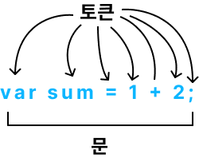

<!-- @format -->

# **표현식과 문**

**개념을 이해하여 용어를 정확히 이해하고 설명할 수 있도록 노력해보자.**

---

## **값**

**식(표현식)이 평가되어 생성된 결과**를 말한다.

평가란 식을 해석해서 값을 생성하거나 참조하는 것을 의미한다.

```js
10 + 20; // 30
```

10 + 20은 평가되어 숫자 값 30을 생성한다.

모든 값은 데이터 타입을 가지며, 메모리에 2진수, 즉 비트의 나열로 저장된다.

```js
var sum = 10 + 20;
```

10 + 20이 변수 sum에 할당되는 것이 아니라 10 + 20이 평과된 결과인 숫자 값 30이 변수 sum에 할당된다.

따라서 식은 할당 이전에 평가되어 값을 생성해야 한다.

<br/>

---

## **리터럴**

사람이 이해할 수 있는 문자 또는 약속된 기호를 사용해 값을 생성하는 표기법

```js
3;
```

위의 3은 단순한 숫자 3이 아니라 **숫자 리터럴**이다. 사람이 이해할 수 있는 아라비아 숫자를 사용해 숫자 리터럴 3을 코드에 기술하면 자바스크립트 엔진은 이를 평가하여 숫자 값 3을 생성한다.

자바스크립트 엔진은 코드가 실행되는 시점인 런타임에 리터럴을 평가해 값을 생성한다.
즉, 리터럴은 값을 생성하기 위해 미리 약속한 표기법이라고 할 수 있다.

<br/>

---

## **표현식**

값으로 평가될 수 있는 문
표현식이 평가되면 새로운 값을 생성하거나 기존 값을 참조한다.

리터럴도 표현식이다.

```js
var x = 1 + 2;
x + 3;
```

표현식은 다른 표현식의 일부가 되어 새로운 값을 만들어낼 수 있다.

<br/>

---

## **문**

프로그램을 구성하는 기본 단위위자 최소 실행 단위
문의 집합 = 프로그램
문을 작성하고 순서에 맞게 나열 = 프로그래밍

문은 여러 토큰으로 구성된다.

**토큰이란** 문법적인 의미를 가지며, 문법적으로 더 이상 나눌 수 없는 코드의 기본 요소를 의미한다.



문을 명령문이라고도 부른다. 문은 컴퓨터에 내리는 명령이다.

문은 선언문, 할당문, 조건문, 반복문 등으로 구분할 수 있다.

```js
// 변수 선언문
var x;

// 할당문
x = 5;

// 함수 선언문
function foo() {}

// 조건문
if (x > 1) {
	console.log(x);
}

// 반복문
for (var = i; i <2; i++){console.log(i);}

```

<br/>

---

## **세미콜론과 세미콜론 자동 삽입 기능**

세미콜론(;)은 문의 종료를 나타낸다.
문을 끝낼 때는 세미콜론을 붙여햐 한다.
단, 0개 이상의 문을 중괄호({})로 묶은 코드 블록({...}) 뒤에는 세미콜론을 붙이지 않는다.
코드 블록은 언제나 문의 종료를 의미하는 자체 종결성을 갖기 때문이다.

자바스크립트 엔진이 소스코드를 해석할 때 문의 끝이라고 예측되는 지점에 세미콜론을 자동으로 붙여주는 **세미콜론 자동 삽입 기능**(ASI)이 암묵적으로 수행된다.

<br/>

---

## **표현식인 문과 표현식이 아닌 문**

표현식은 문의 일부일 수도 있고, 그 자체로 문이 될 수 도 있다.

### **표현식과 문을 구별하는 방법**

구별하는 가장 간단하고 명료한 방법은 변수에 할당해 보는 것이다.
-> 표현식인 문은 값으로 평가되므로 변수에 할당할 수 있다.
하지만 표현식이 아닌 문은 값으로 평가할 수 없으므로 변수에 할당하면 에러가 발생한다.

```js
// 표현식이 아닌 문은 사용불가
var foo = var x; // SyntaxError
```

변수 선언문은 표현식이 아닌 문이다.
값으로 평가될 수 없다.

```js
// 변수 선언문은 표현식이 아닌 문
var x;

// 할당문은 그 자체가 표현식이지만 완전한 문이다. 할당문은 표현식인 문
x = 100;
```

할당문은 표현식인 문이기 때문에 값처럼 사용할 수 있다.
